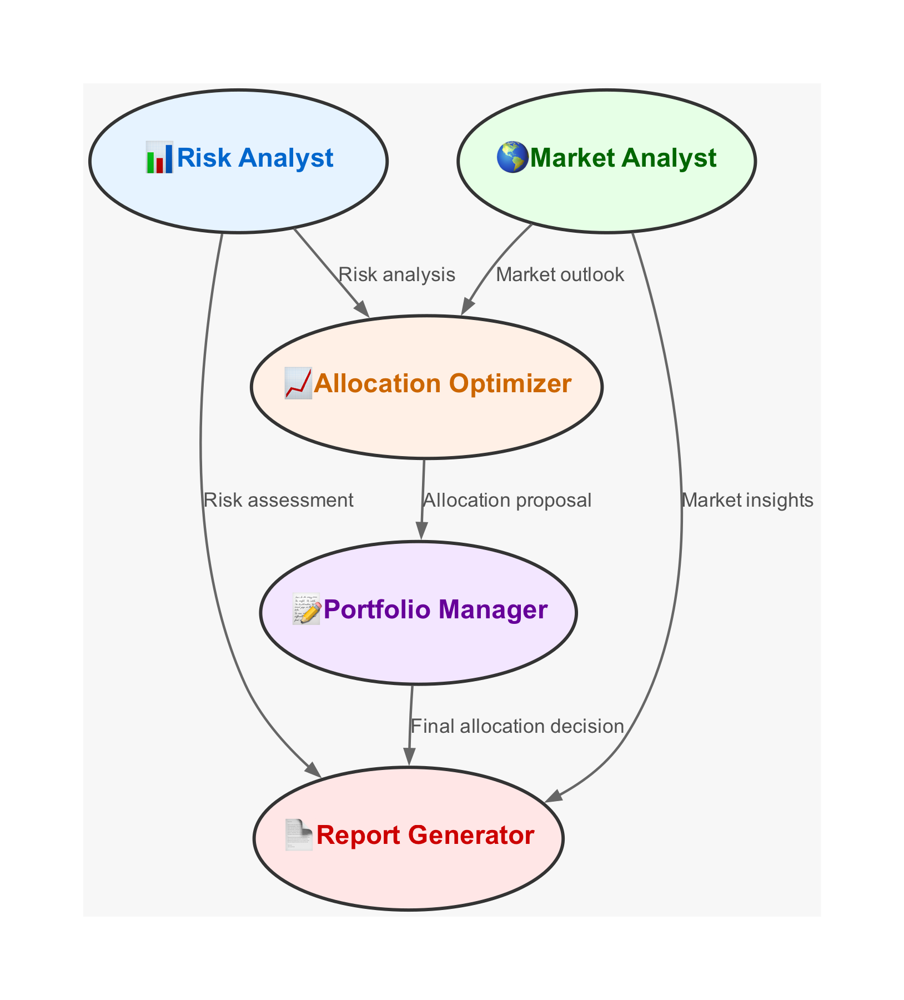

# Multi-Agent Portfolio Analysis System



## Overview

This project implements a sophisticated multi-agent system for comprehensive portfolio analysis and optimization. It demonstrates how multiple AI agents with specialized roles can collaborate to analyze financial data, assess risks, provide market insights, optimize allocations, and generate detailed investment reports.

## Table of Contents

- [How Multi-Agent Systems Work](#how-multi-agent-systems-work)
- [Agents in This System](#agents-in-this-system)
- [Agent Communication Flow](#agent-communication-flow)
- [Implementation Details](#implementation-details)
- [Example Agent Outputs](#example-agent-outputs)
- [Getting Started](#getting-started)
- [Requirements](#requirements)
- [Usage](#usage)

## How Multi-Agent Systems Work

Multi-agent systems (MAS) are computational systems where multiple intelligent agents interact to solve problems that are difficult or impossible for an individual agent to solve. In the context of AI and LLMs (Large Language Models), these agents are specialized instances of language models with:

1. **Specialized Roles**: Each agent has a specific role, expertise, and objective
2. **Unique Perspectives**: Agents approach problems from different angles based on their specialization
3. **Collaborative Problem-Solving**: Agents work together, sharing insights and building on each other's work
4. **Emergent Intelligence**: The collective output often exceeds what any single agent could produce

### Key Components of Agent Architecture

1. **Role Definition**: Clear description of the agent's specialized function
2. **Goal Setting**: Specific objectives the agent aims to achieve
3. **Backstory/Context**: Background information that shapes the agent's perspective and expertise
4. **Task Assignment**: Specific instructions for what the agent needs to accomplish
5. **Communication Channels**: Methods for agents to share information and build on each other's work

## Agents in This System

This portfolio analysis system implements five specialized agents:

### 1. Risk Analyst

- **Role**: Evaluates portfolio volatility and risks
- **Goal**: Suggest specific changes to improve risk-adjusted returns
- **Expertise**: Risk assessment, quantitative strategies, multi-asset portfolio construction
- **Output**: Detailed risk analysis with specific diversification recommendations

### 2. Market Analyst

- **Role**: Analyzes market conditions and sector trends
- **Goal**: Provide deep market insights and identify diversification opportunities
- **Expertise**: Macroeconomic trends, sector analysis, stock selection
- **Output**: Comprehensive market analysis with specific sector and company recommendations

### 3. Allocation Optimizer

- **Role**: Optimizes portfolio allocation across assets
- **Goal**: Maximize risk-adjusted returns through strategic allocation
- **Expertise**: Portfolio optimization, quantitative finance, modern portfolio theory
- **Output**: Detailed allocation proposals with specific investment recommendations

### 4. Portfolio Manager

- **Role**: Makes final allocation decisions
- **Goal**: Balance recommendations from other agents into a cohesive strategy
- **Expertise**: Asset allocation, security selection, portfolio implementation
- **Output**: Final portfolio decisions with implementation strategies

### 5. Report Generator

- **Role**: Creates comprehensive investment reports
- **Goal**: Translate complex analyses into clear, actionable client reports
- **Expertise**: Financial writing, report structuring, client communication
- **Output**: Professional investment report with specific recommendations

## Agent Communication Flow

The workflow diagram illustrates how agents interact in this system:

1. The **Risk Analyst** and **Market Analyst** work independently to analyze portfolio risks and market conditions
2. Both analysts feed their insights to the **Allocation Optimizer**
3. The **Allocation Optimizer** proposes portfolio changes based on these insights
4. The **Portfolio Manager** reviews all recommendations and makes final allocation decisions
5. The **Report Generator** compiles inputs from all agents into a comprehensive report
6. Direct connections also exist between the analysts and the report generator

This workflow demonstrates how specialized agents can collaborate to produce comprehensive financial analysis that would be challenging for a single agent to accomplish.

## Implementation Details

This system is implemented using:

1. **CrewAI**: A framework for orchestrating role-playing agents
2. **LangChain**: For connecting the LLM agents to external tools and data
3. **OpenAI's GPT Models**: Powering the intelligence of each agent
4. **Financial Data Processing**: Using yfinance, pandas, and numpy for data analysis
5. **Visualization**: Matplotlib and seaborn for chart generation
6. **Report Generation**: FPDF for creating professional PDF reports

### Key Implementation Components:

```python
# Agent Definition Example
risk_analyst = Agent(
    role="Risk Analyst",
    goal="Evaluate portfolio volatility and risks, suggesting specific changes to improve risk-adjusted returns...",
    backstory="You are a financial analyst with expertise in risk assessment...",
    verbose=True,
    llm=llm
)

# Task Definition Example
risk_analysis_task = Task(
    description="Analyze the portfolio risks based on recent data and calculated metrics...",
    agent=risk_analyst,
    expected_output="Detailed risk analysis report with specific diversification and risk mitigation recommendations."
)

# Multi-Agent System Creation
crew = Crew(
    agents=[risk_analyst, market_analyst, allocation_optimizer, portfolio_manager, report_generator],
    tasks=[risk_analysis_task, market_analysis_task, allocation_task, manager_task, report_task],
    verbose=True
)

# Execution
result = crew.kickoff()
```

## Example Agent Outputs

### Risk Analyst Output (Excerpt)

The Risk Analyst identifies portfolio vulnerabilities and suggests specific mitigation strategies:

> "Identified risks include high volatility, sector concentration, and market-specific risks. Mitigation strategies involve diversifying across asset classes, sectors, and geographic regions. Introducing bonds, REITs, and commodities will reduce volatility, while international equities and factor-based strategies will enhance diversification."

### Market Analyst Output (Excerpt)

The Market Analyst provides sector-specific insights and identifies new investment opportunities:

> "Current market conditions are characterized by volatility and sector-specific risks, particularly in technology and consumer discretionary sectors. The technology sector faces regulatory scrutiny and supply chain disruptions, while consumer discretionary is impacted by inflation and supply chain issues. To mitigate these risks, diversification into healthcare, financials, and industrials is recommended."

### Allocation Optimizer Output (Excerpt)

The Allocation Optimizer proposes specific portfolio changes with precise allocations:

> "The revised portfolio allocation includes:
>
> - AAPL: 12%
> - MSFT: 12%
> - GOOGL: 8%
> - AMZN: 8%
> - TSLA: 4%
> - AGG (Bonds): 12%
> - VNQ (REITs): 8%
> - GLD (Commodities): 4%
> - ACWX (International): 8%
> - VLUE (Value): 4%
> - QUAL (Quality): 4%
> - Healthcare: JNJ 2.5%, PFE 1.5%, MRNA 1.5%
> - Financials: JPM 2.5%, GS 1.5%, V 1.5%
> - Industrials: GE 2.5%, CAT 1.5%, HON 1.5%"

This balanced allocation totals exactly 100% while maintaining diversification across technology stocks, fixed income, real estate, commodities, international exposure, factor-based investments, and sector-specific stocks.

### Portfolio Manager Output (Excerpt)

The Portfolio Manager creates an implementation strategy with specific timelines:

> "Implementation Strategy: 1. Immediate (0-3 months): Rebalance technology and consumer discretionary holdings. Initiate positions in AGG, VNQ, GLD, and ACWX. 2. Short-Term (3-6 months): Introduce healthcare, financials, and industrials stocks..."

## Getting Started

### Requirements

```
crewai
langchain-openai
yfinance
pandas
numpy
matplotlib
seaborn
fpdf
graphviz
python-dotenv
```

### Usage

1. Clone this repository
2. Install dependencies: `pip install -r requirements.txt`
3. Create a `.env` file with your OpenAI API key: `OPENAI_API_KEY=your_api_key_here`
4. Run the application: `python app.py`
5. Review the generated PDF report and charts

## Conclusion

This multi-agent portfolio analysis system demonstrates how specialized AI agents can collaborate to produce comprehensive financial analysis and recommendations. By dividing complex tasks among specialized agents, the system achieves a level of depth and breadth that would be challenging for a single agent to accomplish.

The implementation showcases how modern AI frameworks like CrewAI and LangChain can be used to create sophisticated multi-agent systems for real-world applications in finance and beyond.
